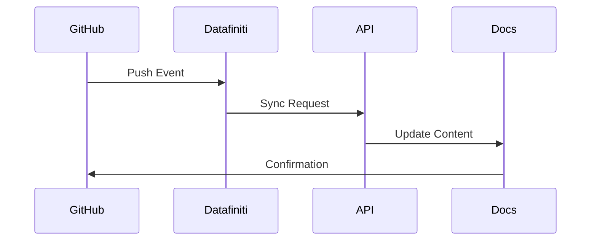

## Overview

Datafiniti integrates seamlessly with popular tools to enhance your documentation workflow. You can connect to collaboration platforms, set up webhooks for real-time notifications, access our REST API for custom solutions, embed external content, and sync with version control systems.

<Columns cols={3}>
  <Card title="GitHub" icon="github" href="#github-integration">
    Automate documentation updates from your repositories.
  </Card>
  <Card title="Slack" icon="message-circle" href="#slack-integration">
    Get instant notifications for documentation changes.
  </Card>
  <Card title="Webhooks" icon="zap" href="#webhooks">
    Trigger actions on events like page updates.
  </Card>
</Columns>

## Third-Party App Connections

Connect Datafiniti to GitHub and Slack for better collaboration.

<Tabs>
  <Tab title="GitHub" icon="github">

    ### Connect to GitHub

    Link your Datafiniti space to a GitHub repository to sync documentation changes.

    <Steps>
      <Step title="Authorize GitHub" icon="key">
        In your Datafiniti dashboard, navigate to Integrations > GitHub and click "Connect". Grant permissions for repository access.
      </Step>
      <Step title="Select Repository" icon="git-branch">
        Choose the repository and branch you want to sync.
      </Step>
      <Step title="Configure Sync" icon="settings">
        Set sync direction: push from GitHub to Datafiniti or pull changes.
      </Step>
    </Steps>

    <Callout kind="tip">
      Use GitHub Actions for automated deployments to Datafiniti.
    </Callout>

  </Tab>
  <Tab title="Slack" icon="message-circle">

    ### Connect to Slack

    Receive notifications in Slack for documentation events.

    <Steps>
      <Step title="Add Slack App" icon="plus">
        Install the Datafiniti app from the Slack App Directory.
      </Step>
      <Step title="Configure Channel" icon="hash">
        Select the Slack workspace and channel for notifications.
      </Step>
      <Step title="Enable Events" icon="bell">
        Choose events like page updates or new comments.
      </Step>
    </Steps>

  </Tab>
</Tabs>

## Webhook Setup for Automation

Webhooks allow you to receive real-time events from Datafiniti. Set up a webhook endpoint to handle payloads for events like document updates.

### Create a Webhook

<Steps>
  <Step title="Generate Webhook URL" icon="link">
    Go to Settings > Webhooks and create a new webhook. Copy the generated URL.
  </Step>
  <Step title="Configure Endpoint" icon="server">
    Expose your server endpoint at `{YOUR_WEBHOOK_URL}`.
  </Step>
  <Step title="Verify Secret" icon="shield">
    Use the signing secret to validate incoming requests.
  </Step>
</Steps>

Here's an example Node.js endpoint to handle the webhook:

<CodeGroup tabs="Node.js,Python">
  ```javascript
  const express = require('express');
  const crypto = require('crypto');
  const app = express();

  app.use(express.raw({type: 'application/json'}));

  app.post('/webhook', (req, res) => {
    const signature = req.headers['x-datafiniti-signature'];
    const secret = 'YOUR_WEBHOOK_SECRET';
    const hash = 'sha256=' + crypto.createHmac('sha256', secret)
      .update(req.body).digest('hex');
    
    if (signature === hash) {
      console.log('Event:', JSON.parse(req.body));
      res.status(200).send('OK');
    } else {
      res.status(401).send('Unauthorized');
    }
  });

  app.listen(3000);
  ```
  ```python
  from flask import Flask, request
  import hmac
  import hashlib
  import json

  app = Flask(__name__)
  SECRET = 'YOUR_WEBHOOK_SECRET'

  @app.route('/webhook', methods=['POST'])
  def webhook():
      signature = request.headers.get('X-Datafiniti-Signature')
      expected = 'sha256=' + hmac.new(
          SECRET.encode(), request.data, hashlib.sha256
      ).hexdigest()
      
      if signature == expected:
          print('Event:', json.loads(request.data))
          return 'OK', 200
      return 'Unauthorized', 401

  if __name__ == '__main__':
      app.run(port=3000)
  ```
</CodeGroup>

## API Access for Custom Integrations

Build custom integrations using Datafiniti's REST API at `https://api.example.com/v1`.

<Request tabs="cURL,JavaScript">
  ```bash
  curl -X POST https://api.example.com/v1/documents \
    -H "Authorization: Bearer YOUR_API_KEY" \
    -H "Content-Type: application/json" \
    -d '{
      "title": "New Document",
      "content": "Hello from integration"
    }'
  ```
  ```javascript
  const response = await fetch('https://api.example.com/v1/documents', {
    method: 'POST',
    headers: {
      'Authorization': 'Bearer YOUR_API_KEY',
      'Content-Type': 'application/json'
    },
    body: JSON.stringify({
      title: 'New Document',
      content: 'Hello from integration'
    })
  });
  ```
</Request>

<Response tabs="200">
  ```json
  {
    "id": "doc_123abc",
    "title": "New Document",
    "status": "created"
  }
  ```
</Response>

<ParamField path="title" param-type="string" required="true">
  Document title.
</ParamField>

<ParamField header="Authorization" param-type="string" required="true">
  Bearer token: `Bearer YOUR_API_KEY`.
</ParamField>

## Embedding External Content

Embed live content from external sources using iframes or oEmbed.

```html
<iframe src="https://your-embed-url.com/widget" width="100%" height="400"></iframe>
```

<Callout kind="alert">
  Ensure embedded content complies with your security policies. Use sandbox attributes for iframes.
</Callout>

## Syncing with Version Control

Sync your Datafiniti documentation with Git providers.

<Expandable title="Advanced Git Sync Options" default-open="false">

Configure CI/CD pipelines for automatic syncing.

```yaml
# .github/workflows/sync-docs.yml
name: Sync Docs
on: push
jobs:
  sync:
    runs-on: ubuntu-latest
    steps:
      - uses: actions/checkout@v3
      - name: Sync to Datafiniti
        run: curl -X POST https://api.example.com/v1/sync \
          -H "Authorization: Bearer ${{ secrets.DATAFINITI_KEY }}" \
          -d '{"repo": "user/repo"}'
```

</Expandable>

