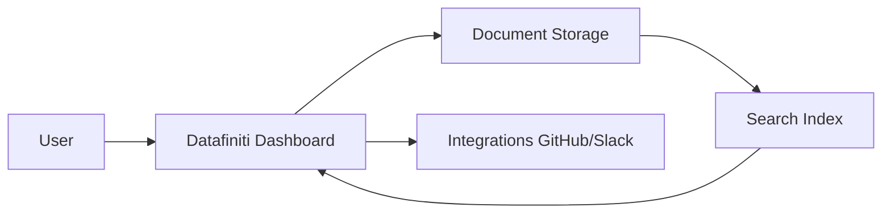

<Callout kind="info" title="Starter Kit Template">
  This documentation was generated as a starter kit template based on your brand. Please review and customize the content to accurately reflect your product's features, APIs, and capabilities.
</Callout>

## Overview

Datafiniti helps you organize and manage project documentation efficiently. You create structured spaces for your teams to collaborate, search, and maintain knowledge bases without complexity. Key benefits include intuitive organization, real-time collaboration, powerful search, and seamless integrations that scale with your projects.

## Key Features

<Columns cols={3}>
  <Card title="Intuitive Organization" icon="folder-tree" href="#organization">
    Structure your docs hierarchically with folders, tags, and custom metadata for effortless navigation.
  </Card>
  <Card title="Real-Time Collaboration" icon="users" href="#collaboration">
    Invite team members to edit, comment, and version docs simultaneously, just like Google Docs.
  </Card>
  <Card title="Advanced Search" icon="search" href="#search">
    Full-text search with filters finds exactly what you need, even across large documentation spaces.
  </Card>
  <Card title="Custom Integrations" icon="plug" href="#integrations">
    Connect with GitHub, Slack, and more to automate workflows and keep docs up-to-date.
  </Card>
</Columns>

## Who Should Use Datafiniti

Datafiniti suits various teams. Use the tabs below to see tailored use cases.

<Tabs>
  <Tab title="Developers & Engineers" icon="code">
    Manage API docs, changelogs, and deployment guides in one searchable space.
  </Tab>
  <Tab title="Product Managers" icon="package">
    Centralize roadmaps, user stories, and specs for cross-team alignment.
  </Tab>
  <Tab title="Support Teams" icon="headphones">
    Build self-service knowledge bases with FAQs and troubleshooting guides.
  </Tab>
</Tabs>

## Quick Start

Get running in minutes with these steps.

<Steps>
  <Step title="Sign Up" icon="user-plus">
    Visit [https://datafiniti.com](https://datafiniti.com) and create a free account.
  </Step>
  <Step title="Create a Space" icon="plus">
    Click "New Space" and name it for your project, like "MyApp Docs".
  </Step>
  <Step title="Add Your First Doc" icon="file-text">
    Upload Markdown files or create pages directly. Organize with folders.
  </Step>
  <Step title="Invite Collaborators" icon="share-2">
    Share the space link and add team members via email.
  </Step>
</Steps>

<CodeGroup tabs="CLI,API">
  ```bash
  # Install Datafiniti CLI
  npm install -g @datafiniti/cli

  # Login and sync docs
  datafiniti login
  datafiniti sync ./docs-folder
  ```
  ```javascript
  // Initialize client
  const client = new DatafinitiClient({ apiKey: 'YOUR_API_KEY' });

  // Create a new space
  await client.spaces.create({ name: 'My Project Docs' });
  ```
</CodeGroup>

## Architecture Overview

Datafiniti uses a simple, scalable architecture.



## Next Steps

<Columns cols={2}>
  <Card title="Quickstart Guide" icon="book-open" href="/quickstart">
    Dive into detailed setup and first project creation.
  </Card>
  <Card title="Authentication" icon="key" href="/authentication">
    Secure your spaces with API keys and SSO.
  </Card>
  <Card title="Configuration" icon="settings" href="/configuration">
    Customize themes, permissions, and workflows.
  </Card>
  <Card title="Changelog" icon="git-branch" href="/changelog">
    Stay updated with the latest releases.
  </Card>
</Columns>

<Callout kind="tip">
  Ready to start? Head to the [Quickstart Guide](/quickstart) for hands-on instructions.
</Callout>